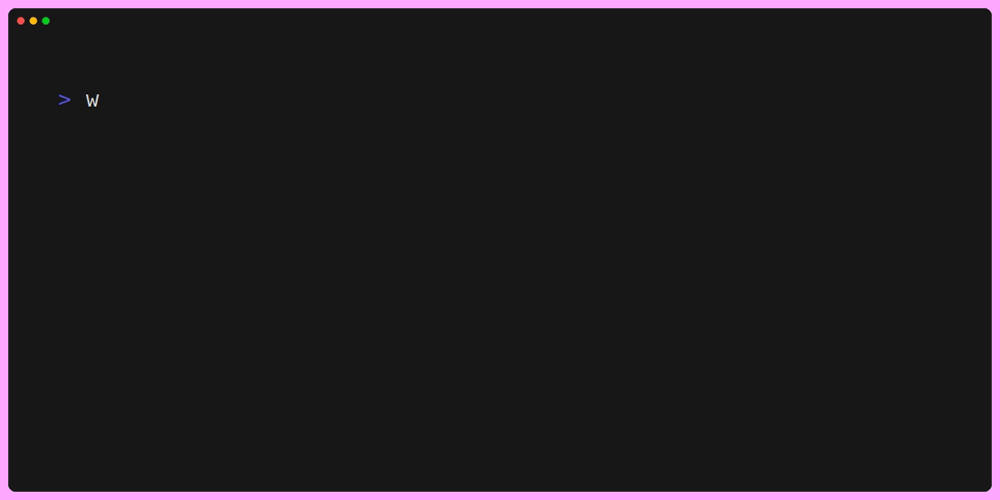

### Teleport files without thinking about paths.

**wormhole** is a tiny shell tool that lets you mark a directory as a destination and then send or copy files to it from anywhere.
It removes the need to remember or retype long paths and integrates smoothly with tmux for fast, terminal-based workflows.

- [Features](#features)
- [Installation](#installation)
  - [TPM](#install-via-tmux-tpm-recommended)
  - [Go](#install-via-go-install)
  - [Build from source](#build-from-source)
- [Example Workflow](#example-workflow)
  - [shell](#shell-a-navigate-where-you-want-files-to-land)
  - [tmux usage](#tmux-usage)

## Features

- **Open a wormhole** in any directory and reuse it across shells
- **Send files** to the active wormhole from anywhere
- **Copy mode** to keep originals intact
- **Force mode** to overwrite existing files when needed
- **Safezone support** for safer transfers
- **Configurable ID** for opening multiple wormholes
- **tmux integration** for opening wormholes

## Installation

The recommended way to install **wormhole** is through the tmux plugin manager (TPM). Make sure Go is installed.

### **Install via tmux TPM (recommended)**

Add the following to your `.tmux.conf`:

```bash
set -g @plugin 'waelmahrous/wormhole'
```

Then press:

```Bash
prefix + I
```

TPM will automatically download the plugin, build the wormhole binary, and install completions.

### Install via go install

```Bash
go install github.com/waelmahrous/wormhole@latest
```

Make sure your Go bin directory is in your PATH:

```Bash
export PATH="$HOME/go/bin:$PATH"
```

Add that line to your shell config (~/.zshrc, ~/.bashrc, etc.) to make it permanent.

### Build from source

Clone the repository and run:

```Bash
make install
```

This builds the application and installs shell autocompletion.

## Example Workflow

### Shell A: navigate where you want files to land
```Bash
cd ~/projects/myapp/build
wormhole open

```
### Shell B: anywhere else
```Bash
wormhole send file1.txt assets/*.png
```

### tmux usage

wormhole comes with the following default keybindings which you can alter:

```Bash
set -g @wormhole_key "O"            # open tree selector
set -g @wormhole_key_current "C-o"  # choose current pane as destination
set -g @wormhole_debug "false"      # show install logs
set -g @wormhole_key_jump "j"       # Open new window at wormhole
```

```Bash
# Opens a tree selector. Pick a pane and a wormhole will open using that pane’s working directory.
prefix-O
```

```Bash
# Instantly opens a wormhole at the current pane’s working directory (no picker).
prefix-Ctrl-o
```
